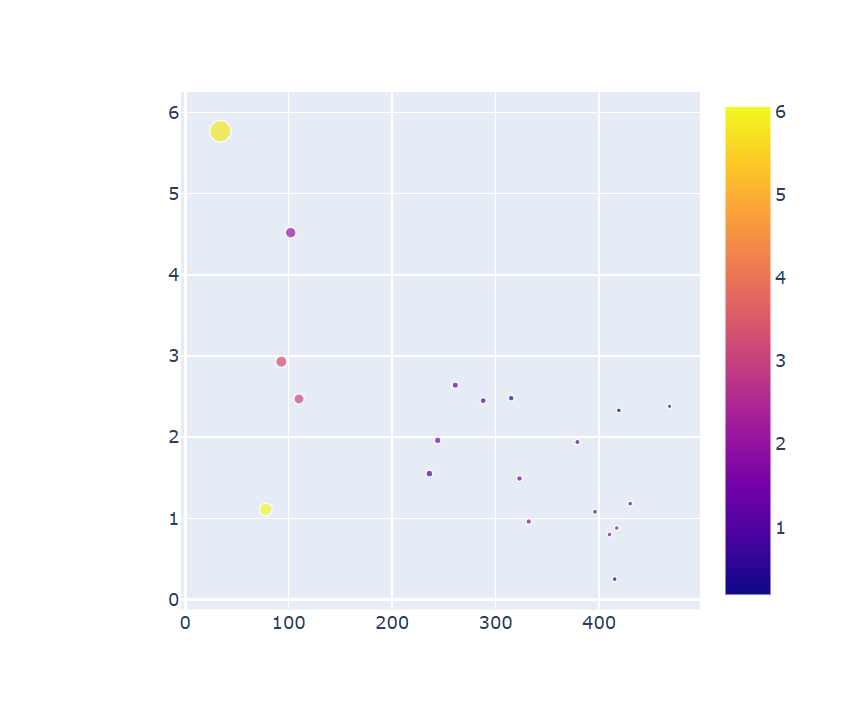
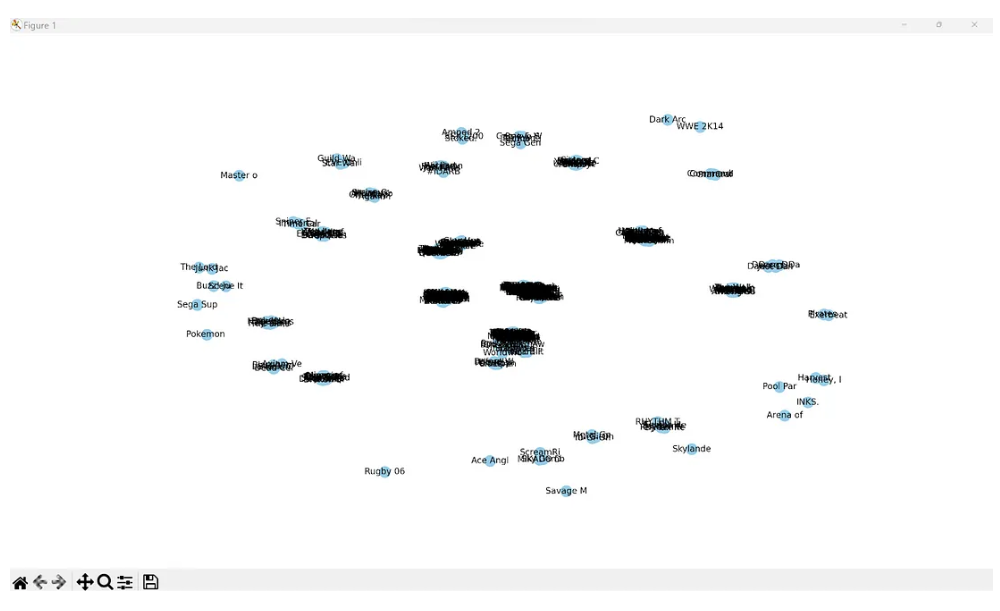

# 🎮 Improved Video Game Sales Visualizations

This project presents two enhanced visualizations based on the [Video Game Sales dataset](https://www.kaggle.com/datasets/gregorut/videogamesales) and [Game Network](https://www.kaggle.com/datasets/beridzeg45/video-games?resource=download) from Kaggle. The original visualizations, while informative in intent, suffered from several data visualization faults that impacted clarity, usability, and accuracy.

Below is a summary of the identified faults and how each was addressed in the updated visualizations.

---

## Visualization 1: Bubble Chart of Global Video Game Sales

### Fault 1: **Missing Data Labels**
- **Explanation:** The original chart did not include any text to identify what each bubble represented (game).
- **Implications:** This made it difficult for users to understand the meaning of each data point, reducing the visualization's value.
- **Fix:** Each bubble now includes a label showing the game's name.

---

### Fault 2: **Absent Chart Title**
- **Explanation:** The original chart had no title, offering no context to the viewer.
- **Implications:** Users were left guessing about the topic and purpose of the chart.
- **Fix:** A clear, descriptive title was added, immediately informing viewers about the chart's subject.

---

### Fault 3: **Ambiguous Y-Axis**
- **Explanation:** The y-axis lacked clear units or labels, making it difficult to interpret the scale of sales.
- **Implications:** Viewers couldn’t extract quantitative information or make comparisons based on bubble positions.
- **Fix:** The y-axis now displays **global sales in millions of units**, making the chart interpretable and accurate.

---

## Visualization 2: Network Graph of Video Game Relationships

### Fault 4: **Visual Overload**
- **Explanation:** The network graph showed too many nodes and edges without labels, making it unreadable.
- **Implications:** Users were overwhelmed and could not identify relationships or insights within the data.
- **Fix:** The number of nodes was reduced by filtering the dataset to top games

---

### Fault 5: **Context-Free Visualization**
- **Explanation:** The graph lacked a title or any explanation of what relationships were being shown.
- **Implications:** Viewers didn’t know if the graph represented game genres, platforms, or publishers.
- **Fix:** A new title was added along with a short description explaining the graph’s intent.

---

### Fault 6: **Inappropriate Visualization Choice**
- **Explanation:** A network graph was used where a simpler or more structured visualization would have been more effective.
- **Implications:** The visualization was overly complex for the type of data being shown, leading to confusion and misinterpretation.
- **Fix:** Replaced the network graph with a **Sankey diagram** that clearly shows flows between publishers and their games or platforms, allowing users to trace relationships and relative volumes more effectively.

---

## Tools Used
- **Plotly / HoloView** for interactive bubble charts and Sankey Graph
- **Pandas / Python** for data preprocessing
- **Kaggle** for dataset and notebook publishing